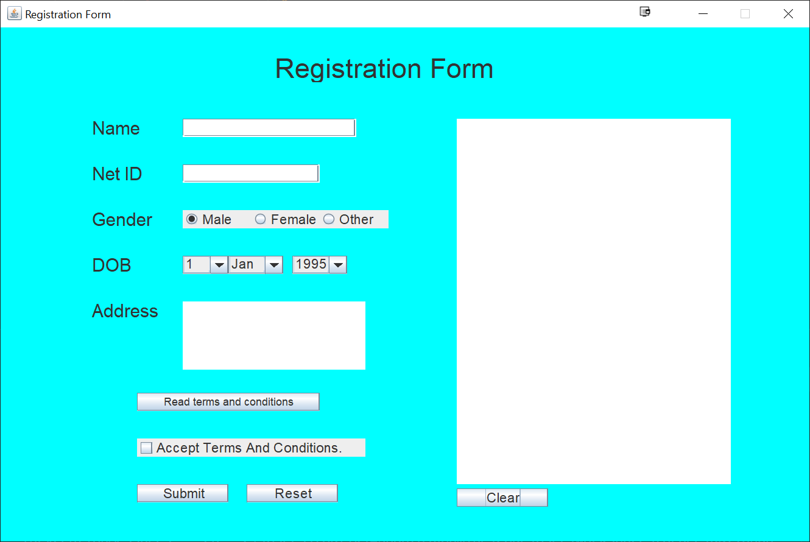

# Graphical User Interface
Due date on Canvas

## Goal: 
The goal of this assignment is to help students familiarize with Java Swing framework 
The homework must be done individually

## Submission Format
* Submission folder  is HW8 folder  
* Submission files: MyFrame.java and Registration.java need to have timestamps before due date   

* Navigate to your class project central
```
cd CS3354/2022Fall
```
* Get the **Projects** folder. <ID> is your individual project directory. 

  * Option 1: get them for the first time
  ```
   cd CS3354/2022Fall
   git clone https://git.txstate.edu/CS3354/<ID>.git
   git clone https://git.txstate.edu/CS3354/2022Fall.git
   ```
  * Option 2: update the codebase 
  
   ```
   cd <ID>
   git pull
   cd ../2022Fall
   git pull
   cd ..    
   ```
* Copy HW8 from projects folder to <ID> folder 
   ```
   cp -r ../Projects/HW8/ <ID>

   ```
  
* Make changes as instructed below and push to repository 
   ```
   cd CS3354/<ID>
   git add HW8/*.*
   git commit -m "HW8 code update comment here"
   gitk
   ```
   * gitk will show you the status, **close** it to continue
   ```
   git push 
   ```
## HW8 sample GUI form
 

## Delivery [1 point]
 Java files in HW8 folder
 
# Tasks   
MyFrame.java and Registration.java is provided as a baseline for this homework. Add code to MyFrame.java to the integrate the following features:   
 
## Task 1 Design [2 points]
 1. Add "Other" RadioButton to the Gender field.  
 2. Add a "Date of Birth" field. (Hint: You can use a JComboBox)  
 3. Add an "Address" field. (Hint: You can use JTextArea)  
## Task 2 Interaction [2 points]
 1. Add "Terms and conditions" button to show terms and conditions in dialog box when clicked.  
 2. Add a "Reset" button to clear all the input fields when clicked.  
 3. Add a "Clear" button to clear the ouput field when clicked.    

### Note: No credit will be given if the code is submitted as is
